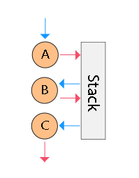
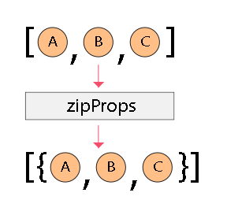

Sequ
==

-------

**Conceptual beta!**

I'm still working on the principle of this tool. It is likely that his behavior and API will change.

-------

Provides an opportunity to plunge into logic decompositions, concatenative programming, and sequence functions in Javascript.


[**API reference**](docs/api.md) - Learn about all opportunities

Install:
```shell
yarn add sequ
```

Usage:
```js
import { sequence } from 'sequ';
```

Theory
--

At the heart of the logic decomposition lies the life cycle, which naturally implies the fulfillment of a certain sequence.

If the functional paradigm is designed to encapsulate complex logic, then reactive programming languages, concatenative programming languages - all pursue the goal of this logic decomposing.

The goal is to make the code more intuitive, and the analysis easy. The oldest way to reduce complexity is to sequ.

sequ logic is such logic, which was composed of smaller logics, which in turn composed of even smaller ones. Representation of such decomposition looks fine with describing the lifecycle of the subroutine as a sequence of actions. At in the concatenative paradigm, the juxtaposition of expressions denotes function composition.

Imagine that you write the program as if writing plans for the day.

```js
export default sequence(
  wakeUp,
  washUp,
  warmUp,
  takeAShower,
  haveBreakfast,
  getDressed,
  goOnBusiness,
)
```

Is that the code you'd love to review?

If we go to the source of any item, for example to `haveBreakfast`, then we will see there:

```js
// haveBreakfast.js
export default sequence(
  cookScrambledEggs,
  squeezeOrangeJuice,
  setTheTable,
  toEat
)
```

And `cookScrambledEggs` is:

```js
// cookScrambledEggs.js
export default sequence(
  preheatAPan,
  takeTheEggs,
  breakEggs,
  pourTheEggsIntoAPan,
  waitMin(7),
  turnOfFire,
  putOnThePlate
)
```

Tools for such concatenative style is provided by this package.

Getting started
--

The flow, sequencing function calls, chaining, stream - close concepts.  Imagine the call sequence, where the result of the previous function becomes an argument for the next one, without a declaration of auxiliary variables. In this form, the code looks like a shopping list.

Let start with simple composition.

```js
import { sequence } from 'sequ';

const getHelloMessageByName = name => `Hello, ${name}!`;

const logHello = sequence(
  getHelloMessageByName,
  console.log
);

logHello('Composition');
// console: Hello, Composition!
```

In this example I just concatenates two functions. First function `getHelloMessageByName` returns a string, second `console.log` displays it. Result of first function become argument for second.

Let's abstract our eyes from the imperative logic and look at the sequence function

```js
const logHello = sequence(
  getHelloMessageByName,
  console.log
);
```

Agree that this code is also its notation. But, you may say, "I easily to describe all logic in one function. Why i need composition? Like this:":

```js
function logHello(name) {
  console.log(`Hello, ${name}!`);
}
```

I agree that such simple logic doesn't need decompositions. But rich logic is more difficult to review in one piece. With concatenation, you can get the union of sequd and more understandable logic.

For example, let's create an password change handler by composing few functions.

```js
// This function select value of event target
export function eventToValue(event) {
  return event.target.value;
}
```

```js
// This function validates value and returns own verdict
export function validate(value) {
  return value.length < 7
    ? 'Password is too short'
    : undefined;
}
```

```js
// This function notify user
export function notify(message) {
  notifyBlock.innerText = message || '';
}
```

The logic of these functions is indivisible. It means that I can't sequ it anymore. For this reason, it looks so imperative.

But now we can put it together and get code view more declarative.

```js
import { sequence } from 'sequ';
import {
  eventToValue,
  validate,
  notify
} from 'src/logic'

// Concatenating
export default sequence(
  eventToValue,         // Select value from event
  validate,             // Validate selected value
  notify,               // Notify if the value is invalid
)
```

```js
import { onPasswordChange } from 'src/logic'

passwordInput.addEventListener(
  'change',
  onPasswordChange
);
```

Now the code clearly shows composition of logic. We do not need to interpret the code in our brain to understand what the script does.

**Logic is stored sequd, but used in composition**. And **sequd logic easy to test and reuse**.


Inspiration and principles
--

Originally *sequ* inspired by the [recompose](https://github.com/acdlite/recompose), but later I began to look for inspiration in the [concatenative (stack) languages](https://concatenative.org/wiki/view/Front%20Page) and [decomposition](https://en.wikipedia.org/wiki/Decomposition_(computer_science)), functional decomposition also.

I focused on solving trouble with multiple arguments, which were not resolved in existing decisions. This tool is aimed to creating a sequence of function invocations, linked with each another by, so called, stack.

In terminology of concatenative programming, the _stack_ is some array, which store results of functions invocation. In this case, a functions become *words*, because they looks like a words - we don't call them directly.

_Stack_ is a collection of results of _words_ invokations. Each _word_ invocation makes stack empty, and then it fills it up again with new value.



Look at example and follow comments to watch stack changes:

```js
const randBool = sequence(
  Math.PI, // In: [], Out: [3.14159]
  Math.round, // In: [3.14159], Out: [3]
  Boolean, // In: [3], Out: [true]
)
// Result: boolean
```

Passing constant `Math.PI` will put the Pi value to the stack. Next function `Math.round` will accepts that result as first argument and returns integer. And next function `Boolean` accepts result of `Math.round` and returns boolean.

Each next function will take from stack one value, and put new. And all this flow passes through the stack.

Why we need stack? - you asking me. Because significant limitation of the concatenation is the fact that the function can return only one value, but accepts a few.

For example, I want to create a function for converting user input in to a cubed value. To get cubed value, I should to call `Math.pow` with second argument equals `3`.

```js
const onChange = sequence(
  Number,
  Math.pow, // By the default second parameter is 2, but we needs 3
  console.log,
);

input.addEventListener('change', onChange);
```

In concatenative paradigm the functions must accept no arguments. All parameters must come from the stack. The problem is that the function can return only one value, thus next function will get only one argument, not two as required.

This trouble have to be resolved. And there are three way to call _word_ with an additional arguments.

__I. Encapsulation of call__

Just create higher-level function, which call required function with needed arguments.

```js
const onChange = sequence(
  Number,
  n => Math.pow(n, 3),
  console.log,
);
```
The way is very flexible, but not very honest with respect to stack principles. But you prefer to use it for its simplicity.

__II. Increase stack length__

In concatenative languages, there is such thing as **Stack effect**. It is when the function knows its input and output count of arguments in advance. But javascript is not a concatenative language, it has no methods to get count of function parameters and expected count of results (in general multiple results) from outside. The dilemma lies in maintaining the principles of the stack paradigm and simultaneously keeping nativity of function as is.

Thus, the only way to increase stack length is to forcenatly increase stack. It can be done with passing to the concatenate sequence an array instead a function.

```js
const onChange = sequence(
  [3, Number],
  Math.pow,
  console.log,
);
```

**Note that the values are defined in reverse order**. When you describing such array, you should to take into account the special behavior of the flow:

- The order of the array items must be the reversed relative to the order of expected arguments;
- Each function inside array is treated as a _word_ and will be executed with the current stack;
- Values with non-function type will be placed in the stack directly;
- The previous stack values will be keeped (it means that new values will be pushed to the current stack);
- New stack will apply only after series will complete.

Using this construction, you can declare any number of additional arguments. But keep in mind that the previous value of the stack will always remain at the very beginning of the stack.

__III. Use helpers__

[mapArgs](docs/api.md#mapArgs) allows you force set arguments.

```js
const getRandSquare = sequence(
  mapArgs((val) => [Number(val), 3]),
  Math.pow,
)
```

The best option for dynamic stack length and passing functions in arguments. Unlike other methods, allows you to override the whole stack. Note that the order corresponds to the order of the arguments.

Props-only technique
--

One of effective technique to use concatenation without typical troubles with arguments flowing is to use only one argument. And this argument is always object, called **props**.

When I accepts initial arguments, first thing I must to do is map this arguments to _props_.

Manually:

```js
sequence(
  (a, b, c) => ({ a, b, c });
)
```

Or using special factory `zipProps`:

```js
sequence(
  zipProps(['a', 'b', 'c']),
)
```

[zipProps](docs/api.md#zipProps) compress the arguments into hashmap.



Now. I got only one argument, no needs stack extending anymore. All I need is to use mappers.

Mappers are kind of functions, which accepts props and return new props. And the whole essence of composition is reduced to the composition of mappers.

```js
const mapValidateCardNumber = ({ e }) => ({
  valid: e.target.value.length == 16,
})

const onCardNumberChange = sequence(
  zipProps('e'),
  mapValidateCardNumber,
  ({ e, valid }) => {
    e.target.style.borderColor = valid
      ? 'black'
      : 'red';
  }
)
```

Keep in mind that you can always create hashmap manually, using [spread](https://developer.mozilla.org/en-US/docs/Web/JavaScript/Reference/Operators/Spread_operator) operator.

```js
const mapValidateCardNumber = ({ e, ...props }) => ({
  ...props,
  e,
  valid: e.target.value.length == 16,
})
```

Let's sum up the results
--

What we learned about concatenation:

- `concatenate` returns new function
- The result of previous _word_ will became an argument for the next one
- Words can accept multiple arguments in two cases:
  + It is first word in a sequence;
  + _Stack_ forcibly encreased.
- _Word_ leave behind a stack with a single length;
- You can use _props_ instead args.

Whole tool provides you with passobility to perform:

+ Reduce complexity
+ Data flowing
+ Sequences of transformations, reactivity
+ Separated logic and tests
+ Forking and branching
