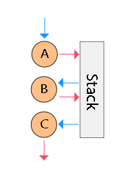

Sequ API Reference
==

# __0.1.4__

* [Factory functions](#factory-functions)
  + [`sequence`](#sequence) ([`sequ`](#sequence), [`f`](#sequence))
  + [`tillTruly`](#tilltruly)
  + [`whileTruly`](#whiletruly)
  + [`tillMatch`](#tillmatch)
  + [`branch`](#branch)
  + [`invoke`](#invoke)
  + [`zipProps`](#zipprops)
  + [`withProps`](#withprops)
  + [`stub`](#stub)
  + [`memoize`](#memoize)
* [Helpers](#helpers)
  + [`fork`](#fork)
  + [`mapArgs`](#mapargs)
  + [`onError`](#onerror)
  + [`then`](#then)

## Factory functions

Factory functions can be used separately from the flow. You are free to use it with any tool.

## `default`

**ref**: `sequence()`, `flow()`, `f()`

```
sequence(
  ...units: (function | array | any)
) : function
```

Compose functions into a flow, where the result of the previous function becomes an argument for a next.

```js
const logSum = sequence(
  (x, y) => x + y,
  sum => `Sum: ${sum}`,
  console.log
);

logSum(2, 3);
// Sum: 5
```

Principles of flow behavior are taken from concetenative programming. The flow is based on the, so called, _words_ and _stack_.

_Word_ is a function that you do not call directly. The _stack_ is an array, which do collect _words_ results and forms arguments for the next _word_.



A word (as the function) can return only one result, which will be used to specify the first argument for a subsequent word. In that way, the limit on the number of incoming arguments is formed.

But you have the opportunity to increase the stack, thereby increasing the number of incoming arguments, by passing array, instead a function.

Using an array, we can easily add additional data to the stack.

```js
const logSum = sequence(
  // Initial stack is [3, 2]. Formed from arguments.
  [
    'A', 'B', 'C', 'D'
  ],
  // Now stack is [3, 2, A, B, C, D]
  console.log
  // Args are [D, C, B, A, 2, 3]
);

logSum(2, 3);
// log: [D, C, B, A, 2, 3]
```

As you can see, arguments are formed from the stack in reverse order.

To better understand the principle of the stack, imagine that the stack is a deck of cards, and you cut from top of the deck one card, which will become a first argument, and then you cut next card from the top and it will become second argument, etc. - this is how the stack turns into arguments.

The larger the stack, the more arguments will be passed to the next function.

```js
sequence(
  ['2', '4', '5', '6', '7', '8', '9', '10'],
  ['Jack', 'Queen', 'King', 'Ace'],
  (
    ace, // Ace
    king, // King
    queen, // Queen
    jack, // Jack
    ten, // 10
    nine, // 9
    eight, // 8
    seven, // 7
    six, // 6
    five, // 5
    four, // 4
    three, // 3
    two // 2
  ) => {
    // Do smth with cards
  },
)
```

But, if the stream encounters a function, the stack is reset to zero and again takes on only one value.

```js
sequence(
  ['2', '4', '5', '6', '7', '8', '9', '10'],
  ['Jack', 'Queen', 'King', 'Ace'],
  () => 'Joker',
  (...all) => all.length,
  console.log,
)();

// log: 1
```
However, the use of functions inside the array does not result in the zeroing of the current stack. You can use this for parallel calculations.

```js
const onKeyDown = sequence(
  [event => event.which === 13],
  (isEnter, event) => {
    if (isEnter) {
      event.preventDefault();
    }
  }
);
```

As well as it is worthwhile to understand that the flow obtained through concatenation is simply a function.


## `tillTruly()`

```
tillTruly(
  ...fn: function
) : function => any
```

Invokes passed functions in turn, until the true value returns. If the true result is not obtained, tillTruly will return _undefined_.

```js
const validateValue = tillTruly(
  value => value.length < 5 && 'Value too short',
  value => (!/^[\w\d\s]*$/.test(value) ? 'Invalid symbols' : undefined),
  value => value.length > 20 && 'Value too big',
);

const onValueChange = sequence(
  validateValue,
  (message) => (
    message
    ? console.warn(`message`)
    ? console.log('Valid')
  )
);

onValueChange('Hello%World');
// console: 'Invalid symbols'
onValueChange('Hello World');
// console: 'Valid!'

```

## `whileTruly()`

```js
whileTruly(
  ...fn: function
) : function => any
```

Invokes passed functions in a flow, as long as they return truly value. Breaks the sequence if result falsy. Returns result of last called function.

```js
export const entitiesSelector = whileTruly(
  state => state.db,
  db => db.entities, // Will not be called
);

entitiesSelector({});
```

## `tillMatch()`

```
tillMatch(
  fns: functions,
  match: function | any,
  finally: any,
) : function => any
```

Like `tillTruly`, but accepts an array of functions, or constants, or hashmap (of functions, or of constants) in the first arg, and match results in turn, until it matches the user condition, which placed at second argument.

Returns the matched result or key of the hashmap.

If there is no result match, returns the value of the third argument. Wherein third argument can be a function, which accepts current arguments and returns value at failure.

```js
const detectMailService = tillMatch({
    gmail: '@gmail.com',
    facebook: '@facebook.com',
    yandex: '@yandex.ru',
  },
  (suffix, email) => email.endsWith(suffix)
)

detectMailService('vladimirmorulus@gmail.com'); // gmail
```

## `branch()`

```
branch(
  condition: function,
  onTrue: function,
  onFalse: function,
) : function => any,
```

Accepts a test function and two possible functions to continue. Test function will be invoked with current args, and if it returns true, then next function in the flow will be `onTrue`, and `onFalse` in otherwise case.

```js
const preventEnter = branch(
  e => e.which === 13,
  e => e.preventDefault,
);
input.addEventListener('keydown', preventEnter);
```

## `invoke()`

```
invoke(
  functionFactory : function
) : function
```

Invokes result of the custom function with same args. Assumes that the function returns a function (function factory). Basic helper for multicase branching.

```js
import validateForm form './logic/validateForm';
import saveForm from './logic/saveForm';
import displayWarning from './logic/displayWarning';

const resolveValidation = invoke((valid) => {
  return valid
    ? saveForm
    : displayWarning;
});

const onFormSubmit = sequence(
  [validateForm],
  resolveValidation,
)
```

You can specify arguments, which will be passed to the returned function.

```js
const resolveValidation = invoke((valid, values) => {
  return valid
    ? [saveForm, values],
    : [displayWarning, 'Form invalid'];
});
```

If the function has returned no function (or no array), it just returns.

## `zipProps()`

`zipProps([keys: array<string>]) : function`

Accepts a list of keys according to the order of the arguments. The result becomes an hashmap, containing arguments values.

Use it to map initial arguments to props, when the [props-only technique](../README.md#props-only-technique) you were chosen.

```js
const setUserName = sequence(
  zipProps('firstName', 'lastName'),
  ({ firstName, lastName }) => {
    // Do something with props
  },
)

setUserName('Vladimir', 'Morulus');
```

## `withProps()`

`withProps(propsCreator) : function`

Accepts function, that returns props, which will be merged with existing props.

```js
const flow = sequence(
  a => ({
    a,
  }),
  withProps(({ a }) => ({
    b: a + 1,
  })),
  console.log,
)

flow(5);
// console: { a: 5, b: 6 }
```

Can accept static object.

```js
const mapper = withProps({
  a: 2
});
```

## `stub()`

`stub(value: any) : function => any`

Proxies props if it is truly, returns specified value if it is falsy.

```js
const sub25 = stub(25);

stub(null); // 25
stub(0); // 25
stub(15): // 15
stub({}): // {}
```

## `memoize()`

```
memoize(
  selector: function,
  ?isEqual: function
) : function => any
```

Invoke function only if arguments are not equaled previous call, Otherwise, returns cached result.

# Helpers

Helper is a util, which cannot be used separately from the concatenative flow. It allows you to get special flow features, that is unavailable by native functions.

## `fork()`

`fork([handler: function])`

Invoke function without any effect on the custom flow.

```js
sequence(
  ['Hello'],
  fork(() => {
    return 'Bonjour';
  }),
  console.log,
)
// log: Hello
```

## `mapArgs()`

`mapArgs(mapper: function) : function => nextArgs`

Allows you force set arguments.

```js
const getSquare = sequence(
  mapArgs((val) => [Number(val), 3]),
  Math.pow,
)

getSquare(3); // 27
```

Allows you to override the whole stack. Note that the order of array corresponds to the order of the arguments.

## `onError()`

`onError(handler: function) : function`

Add sync error handler. Allows you to continue the flow with a new value if current flow has thrown an error.

```js
const flow = sequence(
  1,
  () => { throw new Error(); },
  () => 2, // Skip
  () => 3, // Skip
  onError((e) => {
    return 4;
  }),
  a => a + 1,
);

flow(); // 5
```

## `then()`

`then(handler: function, [catch: function]) : function`

Define async handler, and optional catch handler. Expects Promise on the edge of stack.

```js
sequence(
  Promise.resolve(2),
  then((payload) => {
    return payload * 2;
  }),
  then(console.log),
);
// log: 4
```
